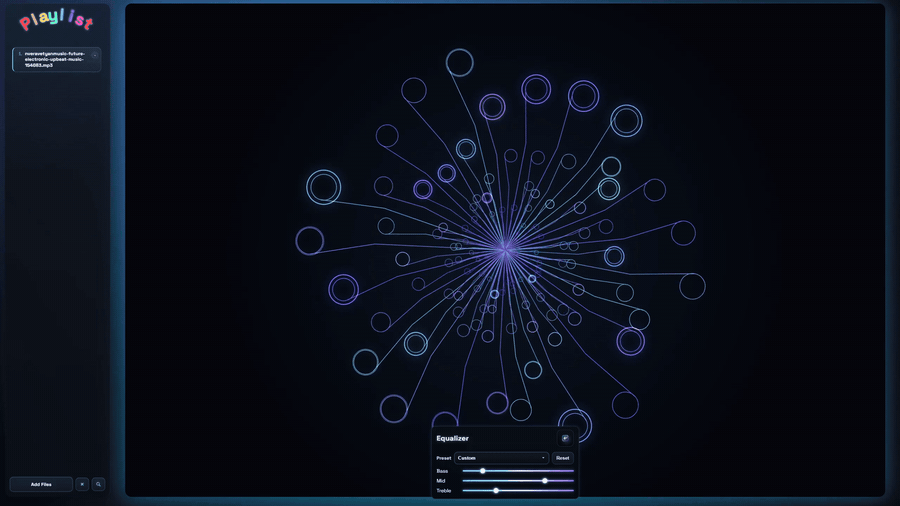
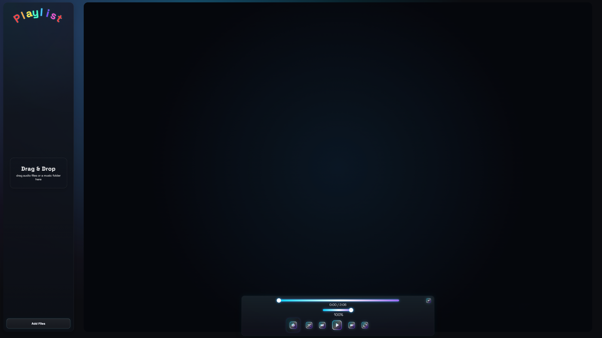
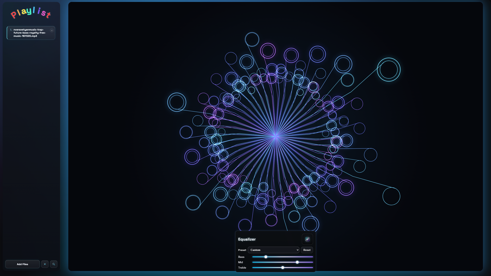
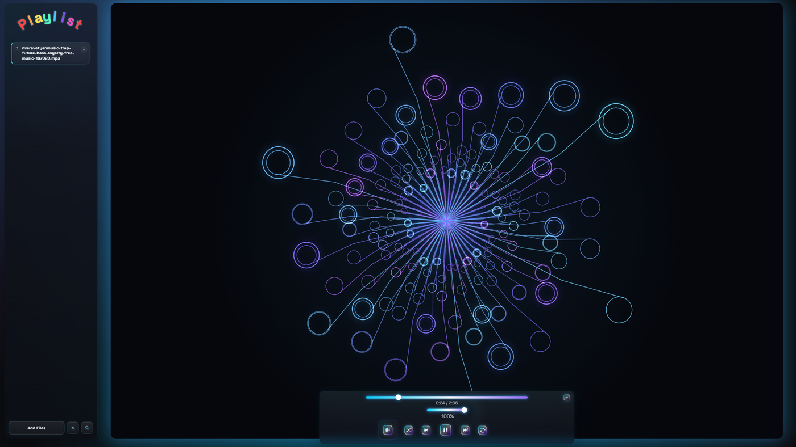
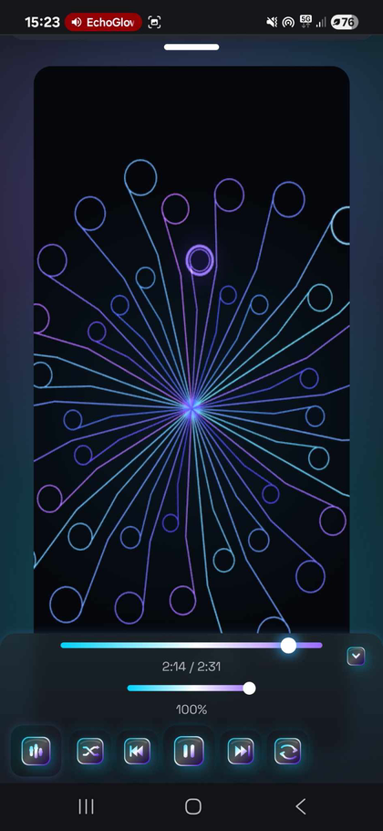

<p align="center">
  
</p>

---

## 🚀 Live Demo
- **Landing page:** https://nataliaans78-lang.github.io/EchoGlow/
- **Player demo:** https://nataliaans78-lang.github.io/EchoGlow/app/

---

## 🎬 Preview

<p align="center">
  
</p>

<p align="center">
  <a href="https://github.com/nataliaans78-lang/EchoGlow/releases/latest/download/EchoGlow.mp4">
    ▶ Download Full MP4 Demo
  </a>
</p>

---

## 🖼️ Screenshots

<table>
  <tr>
    <td valign="top" width="50%">
      
    </td>
    <td valign="top" width="50%">
      
    </td>
  </tr>
  <tr>
    <td valign="top" width="50%">
      
    </td>
    <td valign="middle" width="40%" align="center">
      
    </td>
  </tr>
</table>

---

## ✨ Features

- Drag & drop audio files **and folders**
- Real-time canvas visualizer with neon glow
- 3-band EQ (Bass / Mid / Treble) with presets
- Playlist search
- Shuffle / Repeat
- Playlist & player state persistence (IndexedDB + localStorage)
- Clear modal (`Clear Playlist` / `Reset App`)
- Toast feedback for autosave & storage limits
- Keyboard shortcuts (play/pause, next/prev, seek, volume)
- Mobile layout with slide-down playlist panel
- PWA manifest and Service Worker registration

---

## 🛠️ Tech Stack

- HTML / CSS / Vanilla JS
- Web Audio API (AudioContext + BiquadFilter + Analyser)
- IndexedDB + localStorage
- Service Worker + PWA manifest

EchoGlow is a static site served directly from `docs/`. It does not require npm, dependency installation, or a build step.

---

## 📦 Release

Current version: **v1.0.0**

Initial public release including:
- Stable player build
- UI refinements
- Optimized MP4 demo preview

---

## ▶️ Run Locally

Run the static site with Python:

```bash
cd docs
py -m http.server 8000
```

Then open:

```text
http://localhost:8000/
```

or:

```text
http://localhost:8000/app/
```

No npm commands or build step are needed.

---

## Notes

- Audio files and player state are persisted locally in the browser with IndexedDB and localStorage.
- Uploaded audio stays local to the browser and is not uploaded by the player.
- Large demo media may be hosted through GitHub Releases instead of the Pages site.

---

## License & Credits

The source code is available under the [MIT License](LICENSE).

Project visuals, screenshots, GIFs, and demo media are portfolio assets. They are not granted under the MIT License and should not be reused separately without first checking the applicable rights.

Built with the Web Audio API, Canvas, IndexedDB, and localStorage.
